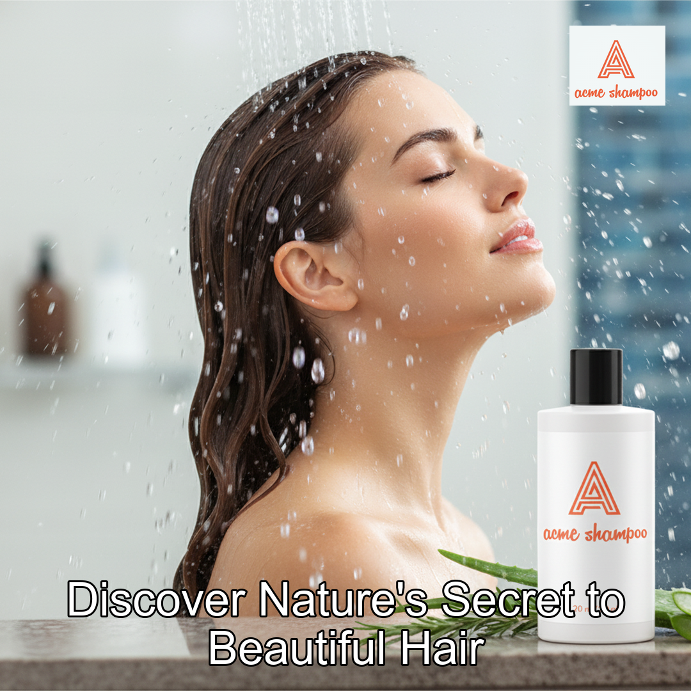
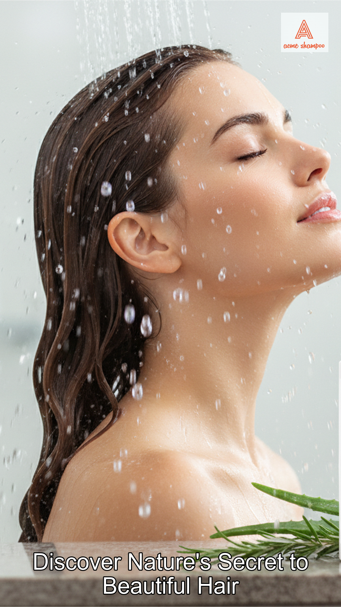
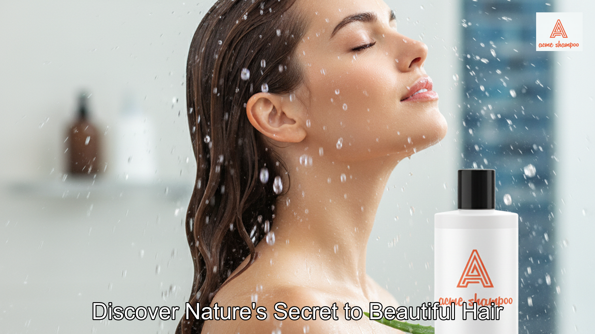

# Creative Automation Pipeline

A proof-of-concept system for automating social media campaign asset generation using GenAI (OpenAI DALL-E 3).

---

## How to Run It

### Prerequisites
- Python 3.10 or higher
- OpenAI API key ([Get one here](https://platform.openai.com/api-keys))

### Installation

1. **Create and activate virtual environment**:
   ```bash
   python -m venv venv
   venv\Scripts\activate  # Windows
   ```

2. **Install dependencies**:
   ```bash
   pip install -r requirements.txt
   ```

3. **Configure API key**:
   
   Create a `.env` file in the project root:
   ```bash
   copy .env.example .env
   ```
   
   Edit `.env` and add your OpenAI API key:
   ```
   OPENAI_API_KEY=sk-your-actual-key-here
   ```

### Run the Pipeline

```bash
python -m src.main campaign/AcmeShampoo
```

**Optional parameters**:
- `--brief <filename>`: Use a different brief file (default: `brief.yaml`)

---

## Example Input and Output

### Input: Campaign Brief

**File**: `campaign/AcmeShampoo/brief.yaml`

```yaml
campaign_id: "summer-2024-promo"

products:
  - id: "product-001"
    name: "Organic Shampoo"
    description: "Natural hair care with botanical extracts"
    hero_image: "assets/shampoo-hero.png"  # Existing image
  
  - id: "product-002"
    name: "Moisturizing Conditioner"
    description: "Deep conditioning treatment"
    # No hero_image - will generate with AI

target_market:
  region: "Latin America"
  language: "es"

target_audience: "Health-conscious millennials aged 25-40"

campaign_message: "Discover Nature's Secret to Beautiful Hair"

brand_elements:
  logo: "assets/logo.png"
  primary_color: "#EB6440"
```

### Input: Assets

```
campaign/AcmeShampoo/assets/
├── logo.png              # Brand logo
└── shampoo-hero.png      # Product 1 image (reused)
```

### Output: Generated Campaign Assets

**Directory structure**:
```
campaign/AcmeShampoo/output/
├── product-001/
│   ├── square/campaign_post.png       # 1080x1080 (Instagram)
│   ├── story/campaign_post.png        # 1080x1920 (Stories)
│   └── landscape/campaign_post.png    # 1920x1080 (Facebook/Twitter)
├── product-002/
│   ├── square/campaign_post.png
│   ├── story/campaign_post.png
│   └── landscape/campaign_post.png
└── generation_report.yaml
```

**Example outputs**:


*Square format (1080x1080) - Instagram post*


*Story format (1080x1920) - Instagram/Facebook stories*


*Landscape format (1920x1080) - Facebook/Twitter posts*

### Output: Generation Report

**File**: `campaign/AcmeShampoo/output/generation_report.yaml`

---

## Key Design Decisions

### 1. Modular Architecture
**Decision**: Separated the pipeline into distinct, single-responsibility modules.

**Rationale**:
- Each module handles one concern (parsing, generation, processing, moderation, etc.)
- Easy to test, debug, and extend independently
- Can swap implementations without affecting other components

**Modules**:
- `brief_parser.py` - YAML parsing and validation
- `asset_manager.py` - File discovery and storage
- `image_generator.py` - OpenAI DALL-E 3 integration
- `image_processor.py` - PIL-based image manipulation
- `content_moderator.py` - Prohibited terms filtering
- `localizer.py` - Text translation (English, Spanish, Japanese)
- `brand_compliance.py` - Brand color presence validation

### 2. Asset Reuse Strategy
**Decision**: Always check for existing assets before generating new ones.

**Rationale**:
- Reduces API costs (DALL-E 3 costs $0.04-0.12 per image)
- Maintains consistency across campaigns
- Faster execution when assets exist

**Implementation**:
- `AssetManager` searches campaign directory for existing images
- Tracks source in metadata report (existing vs. generated)
- Only calls GenAI API when asset is missing

### 3. Smart Image Processing
**Decision**: Use center-crop algorithm with text overlay and logo placement.

**Rationale**:
- Preserves the focal point of images (center)
- Text wrapping ensures messages fit all aspect ratios
- High-contrast stroke ensures readability on any background

**Features**:
- Dynamic font sizing based on image dimensions
- Automatic text wrapping at word boundaries
- Logo overlay with transparency support

### 4. Phase 2 Features (Simplified)
**Decision**: Implement basic versions of content moderation, localization, and brand compliance.

**Content Moderation**:
- Simple prohibited terms list (e.g., "guaranteed", "miracle", "cure")
- Stub for future AI-powered moderation (OpenAI Moderation API)

**Localization**:
- Supports English, Spanish, and Japanese
- Google Translate integration via `deep-translator`
- Language-specific font selection

**Brand Compliance**:
- Single check: Brand color presence detection
- Uses `colorthief` for color analysis
- Validates brand color appears in generated assets

### 5. Configuration Approach
**Decision**: Hardcoded defaults in `pipeline.py` instead of external config files.

**Rationale**:
- Simpler deployment (no config file management)
- Sufficient for POC requirements
- Easy to modify in code for different use cases

**Configuration includes**:
- Aspect ratios (square, story, landscape)
- Text overlay settings (font size, colors, positioning)

---

## Assumptions and Limitations

### Assumptions

1. **Well-Formed Input**
   - Campaign briefs are valid YAML files
   - Product names and descriptions are meaningful for AI generation
   - At least 2 products per campaign

2. **API Availability**
   - OpenAI API is accessible with sufficient quota
   - Stable internet connection for API calls
   - API key has DALL-E 3 permissions

3. **File System**
   - Write permissions in campaign output directories
   - Assets directory is readable
   - Standard file paths work on Windows


### Current Limitations

#### 1. Language Support
**Limitation**: Only English, Spanish, and Japanese supported.

**Impact**: Cannot generate campaigns for other languages (French, German, Chinese, etc.).

**Solution**: Add language codes to `localizer.py` font map.

#### 2. Content Moderation
**Limitation**: Simple keyword filtering only; no AI-powered moderation.

**Impact**: May miss context-dependent inappropriate content.

**Note**: Stub exists in `content_moderator.py` for future OpenAI Moderation API integration.


#### 3. Image Quality
**Limitation**: Generated images are 1024x1024 pixels (DALL-E 3 standard).

**Impact**: May need upscaling for very large format requirements.

**Workaround**: Resize to target dimensions (1080x1080, 1920x1080) which are within quality range.


### Technical Constraints

- **Python Version**: Requires Python 3.10+ (for modern type hints)
- **Dependencies**: Relies on external APIs (OpenAI) and libraries
- **Platform**: Tested on Windows; should work on Linux/Mac with minor adjustments
- **Memory**: Large images may consume significant memory during processing

---

## Future Enhancements

- **Parallel Processing**: Use `asyncio` for concurrent API calls and image processing
- **AI-Powered Moderation**: Integrate OpenAI Moderation API for advanced content safety
- **Cloud Storage**: AWS S3, Azure Blob Storage, Google Cloud Storage integration


## Troubleshooting

### "OpenAI API key required"
- Ensure `.env` file exists in project root
- Verify `OPENAI_API_KEY` is set correctly
- No extra spaces or quotes around the key

### "Brief file not found"
- Check `brief.yaml` exists in campaign directory
- Use `--brief` option to specify different file

### "Failed to generate image"
- Verify API key validity and quota
- Check internet connection
- Review product description (avoid prohibited content)

### "Module not found" errors
- Run `pip install -r requirements.txt`
- Ensure virtual environment is activated

### "Translation failed"
- Check internet connection (Google Translate requires network)
- Falls back to original text automatically